# 🚀 CI/CD Workflows Summary

## Two Separate Workflows:

### 1️⃣ **ci.yml** - Continuous Integration
**Runs on:** Every push & PR to `main` or `develop`

**Jobs:**
- ✅ Backend Tests (Lint + Unit Tests + Coverage)
- ✅ Frontend Tests (Lint + Unit Tests + Build + Coverage)
- ✅ Docker Build Test (Validates image creation)

**Purpose:** Ensure code quality before any deployment

---

### 2️⃣ **deploy.yml** - Continuous Deployment
**Runs on:** After CI succeeds on `main` branch only

**Jobs:**
- 🚢 Docker Push (Build & push to Docker Hub)
- 🚀 Deploy (SSH to remote server & update containers)

**Purpose:** Automated deployment to production

---

## 🔄 Workflow Execution:

```mermaid
graph LR
    A[Push to main] --> B[CI Workflow]
    B -->|✅ Success| C[CD Workflow]
    C --> D[Docker Push]
    D --> E[Remote Deploy]
    B -->|❌ Failure| F[Stop - No Deployment]
```



---

## 📝 Quick Setup:

1. **Add GitHub Secrets:**
   ```
   DOCKER_USERNAME
   DOCKER_PASSWORD
   REMOTE_HOST (optional)
   REMOTE_USER (optional)
   SSH_PRIVATE_KEY (optional)
   ```

2. **Push to main:**
   ```bash
   git push origin main
   ```

3. **Watch Actions tab** in GitHub!

---

## 📚 Full Documentation:
See [CICD.md](./CICD.md) for detailed information.
